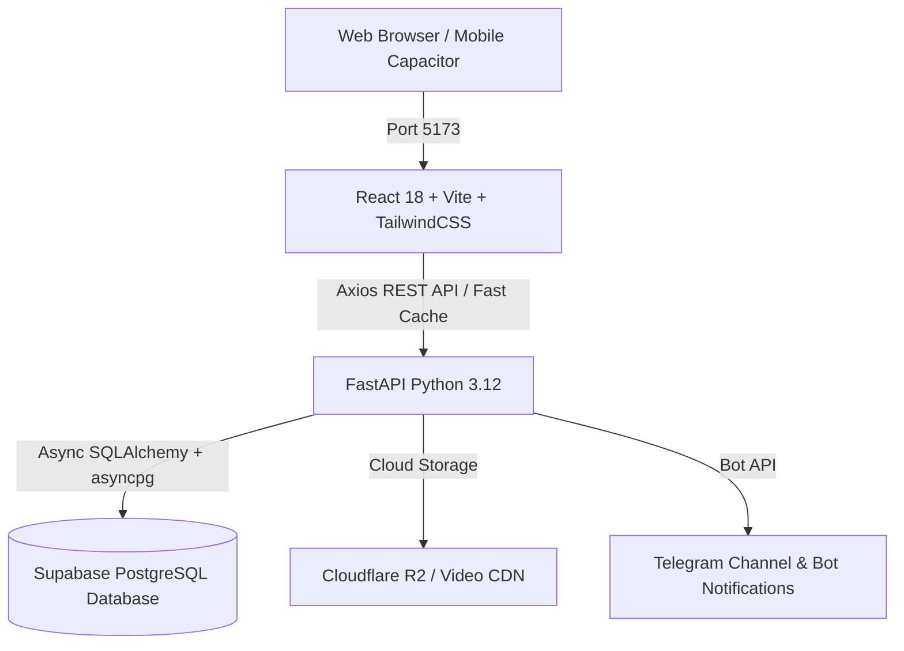

# 🎬 MER DONGHUA (墨尔动画 / ទស្សនារឿង) — IMMORTAL V2

<div align="center">


**វេទិកាទស្សនាភាពយន្ត Anime, Donghua 3D, និង Drama កម្សាន្តកម្រិតខ្ពស់ (Next-Gen Streaming Platform)**  
*រចនាឡើងយ៉ាងប្រណីត Version 2 Design (ភាសាខ្មែរ ១០០%) ដំណើរការលឿន គ្មាន Delay (Zero-Delay Performance)*

[📱 ចូលមើល Website](http://localhost:5173) • [📖 ឯកសារ API Docs](http://localhost:8000/docs) • [💬 Telegram Community](https://t.me/namianime_channel)

</div>

---

## 🌟 លក្ខណៈពិសេសចម្បង (Key Features)

### 🎬 ប្រព័ន្ធទស្សនាភាពយន្ត (Streaming Experience)
- **Cinematic Dark Luxury UI**: រចនាបទបែប Version 2 Luxury Glassmorphism គាំទ្រភាសាខ្មែរ ១០០% ទាំងទូរស័ព្ទ និងកុំព្យូទ័រ។
- **Custom HLS & MP4 Player**: កម្មវិធីចាក់វីដេអូល្បឿនលឿន គាំទ្រ Full HD, Auto-Next Episode, និងចងចាំនាទីទស្សនាចុងក្រោយ (Resume Watching)។
- **Multi-Category Catalog**: ចាត់ថ្នាក់ច្បាស់លាស់៖ រឿងភាគចិន 3D (Donghua), ភាពយន្តភាគ (Drama), ភាពយន្តបែបកុន (Movies), និងគំនូរជីវចល (Anime)។
- **Real-Time Danmaku & Comments**: ខមិនបញ្ចេញមតិ និងអក្សររត់លើវីដេអូ (Danmaku) តាមពេលវេលាជាក់ស្តែង។

### 👑 ប្រព័ន្ធសមាជិកភាព & VIP (VIP & Member Access)
- **VIP Membership Plans**: កំណត់គម្រោង ១ខែ, ៣ខែ, ៦ខែ, ១ឆ្នាំ, និងពេញមួយជីវិត (Lifetime VIP)។
- **Movie Individual Unlock**: មុខងារបើកសិទ្ធិឱ្យ User ទស្សនារឿងកុន (Movie) ជាក់លាក់មួយៗដាច់ដោយឡែក។
- **Telegram & Google Fast Login**: ចូលប្រើប្រាស់ភ្លាមៗជាមួយគណនី Telegram ឬ Google ក្នុងរយៈពេល ០.១ វិនាទី។

### 🛡️ ផ្ទាំងគ្រប់គ្រង Admin កម្រិតខ្ពស់ (Admin Control Panel)
- **ផ្ទាំងគ្រប់គ្រងសមាជិក (User Management)**: កែប្រែ Role (USER, STAFF, ADMIN, OWNER), បើក/បិទ VIP, និងប្រព័ន្ធការពារគណនី Owner ដាច់ខាត (Owner Immunity Protection)។
- **គ្រប់គ្រងភាគរឿង (Episode Management)**: បន្ថែមភាគរឿង កែសម្រួល URL Video, ប្តូរស្ថានភាព Free/VIP, និងមើលតេស្តវីដេអូផ្ទាល់ក្នុងផ្ទាំង Admin (In-Dashboard Preview Player)។
- **បម្រុងទុក & ស្តារទិន្នន័យ (Backup & Restore)**: មុខងារ Backup ទិន្នន័យទៅ Cloud និងស្តារភាគរឿងដែលបាត់បង់មកវិញដោយស្វ័យប្រវត្តិ (Safe Merge Recovery)។
- **ផ្ញើសារដំណឹងទៅ Telegram Bot**: ផ្ញើការជូនដំណឹងភាគរឿងថ្មីៗទៅកាន់ Telegram Channel/Group ដោយស្វ័យប្រវត្តិ។

---

## 🏗️ ស្ថាបត្យកម្មប្រព័ន្ធ (System Architecture)



---

## 📂 រចនាសម្ព័ន្ធគម្រោង (Repository Structure)

```text
Huang-anime/
├── backend/                       # 🐍 FastAPI Backend Engine
│   ├── app/
│   │   ├── api/                   # API Endpoints (anime, episodes, users, admin, auth, stream)
│   │   ├── core/                  # Database engines, Security, JWT, Config
│   │   ├── dependencies/          # Authentication & Role-Based Access Control (RBAC)
│   │   ├── models/                # SQLAlchemy Models (User, Anime, Episode, Banner, Comment)
│   │   ├── schemas/               # Pydantic v2 Request/Response Schemas
│   │   └── services/              # Telegram service, data persistence & sync
│   ├── fix_sequences.py           # PostgreSQL Sequence Auto-Repair Utility
│   └── requirements.txt           # Python Dependencies
│
├── frontend/                      # ⚡ React + Vite + TypeScript Frontend
│   ├── src/
│   │   ├── components/            # Reusable UI Components (Player, Modals, Navbar, Footer)
│   │   ├── pages/                 # User Pages (Home, Watch, Catalog, VIP, Profile)
│   │   │   └── admin/             # Admin Control Pages (Users, Anime, Episodes, Backup, Theme)
│   │   ├── services/              # Axios API Client with In-Memory Fast Cache
│   │   ├── store/                 # Zustand State Stores (authStore, themeStore, confirmStore)
│   │   └── types/                 # TypeScript Type Definitions
│   └── package.json               # Frontend Dependencies & Scripts
│
├── scripts/                       # 🛠️ Automation & Helper Batch Scripts
├── docs/                          # 📖 Architecture & Deployment Documentation
├── .gitignore                     # Git Ignore rules (Strict secrets & large files protection)
└── README.md                      # ឯកសារណែនាំគម្រោង (Project Documentation)
```

---

## 🚀 របៀបតម្លើង និងដំណើរការ (Quick Setup Guide)

### ១. តម្រូវការជាមុន (Prerequisites)
- **Node.js**: v18.0.0 ឬខ្ពស់ជាងនេះ
- **Python**: v3.11 ឬ v3.12
- **Git**: ជំនាន់ចុងក្រោយ

### ២. ដំណើរការ Backend (FastAPI)
```bash
# ចូលទៅកាន់ folder backend
cd backend

# បង្កើត និងបើក Virtual Environment (Windows)
python -m venv venv
.\venv\Scripts\activate

# តម្លើង Dependencies
pip install -r requirements.txt

# បង្កើត .env ដោយចម្លងពី .env.example
copy .env.example .env

# ដំណើរការ Backend Server (Port 8000)
python -m uvicorn app.main:app --host 0.0.0.0 --port 8000 --reload
```

### ៣. ដំណើរការ Frontend (Vite + React)
```bash
# ចូលទៅកាន់ folder frontend
cd frontend

# តម្លើង Packages
npm install

# ដំណើរការ Development Server (Port 5173)
npm run dev
```

---

## 🔒 សុវត្ថិភាព & ការការពារកូដ (Security & Standards)

1. **ការសម្ងាត់ និង Credentials**: គ្មានការ Hardcode API Keys, Passwords, ឬ Database Connection Strings ចូលទៅក្នុង Git ឡើយ — គ្រប់ទិន្នន័យសម្ងាត់ត្រូវបានគ្រប់គ្រងតាមរយៈ `.env` ទាំងស្រុង។
2. **PostgreSQL Sequence Auto-Sync**: ប្រព័ន្ធការពារកំហុស `episodes_pkey` ដោយធ្វើសមកាលកម្ម Sequence ទៅកាន់ `MAX(id)` ដោយស្វ័យប្រវត្តិកាលណាប្រព័ន្ធចាប់ផ្តើម។
3. **Owner Protection**: គណនី Owner ត្រូវបានការពារដាច់ខាត មិនអាចត្រូវ demote ឬ delete ដោយ Admin ផ្សេងទៀតបានឡើយ។
4. **Zero-Delay Optimization**: ប្រព័ន្ធប្រើ In-Memory Fast Cache រួមជាមួយ Timeout 12s ការពារភាពយឺតយ៉ាវ និងធានាថារាល់ការផ្លាស់ប្តូរទិន្នន័យនឹងបង្ហាញឡើងវិញភ្លាមៗ (Instant Feedback)។

---

<div align="center">

**រក្សាសិទ្ធិគ្រប់យ៉ាង © 2026 MER DONGHUA / IMMORTAL TEAM**  
*Developed with ❤️ for the Donghua & Anime Community*

</div>
